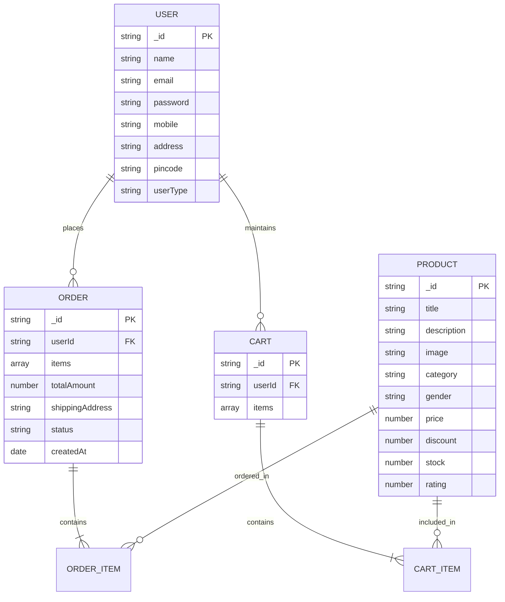

# ShopEZ - Modern E-Commerce Application

Retail Individual ShopEZ is your one-stop destination for effortless online shopping. Designed and implemented with clean MERN Stack architecture (MongoDB, Express, React Vite, Node.js) and modern **Glassmorphism UI** visual design aesthetics.

---

## DEMO AND GITHUB REPOSITORY LINKS

> [!IMPORTANT]
> - ⚡ **Live Render Backend API:** [https://shopez-e-commerces-backend.onrender.com](https://shopez-e-commerces-backend.onrender.com)
> - 🌐 **Live Vercel Frontend:** [https://shopez-e-commerces.vercel.app/](https://shopez-e-commerces.vercel.app/)
> - 📁 **Google Drive Folder:** [https://drive.google.com/drive/folders/1fG8G91dqB9IWfN0Xnj7HlE3toNVWwtCh?usp=sharing](https://drive.google.com/drive/folders/1fG8G91dqB9IWfN0Xnj7HlE3toNVWwtCh?usp=sharing)
> - 📦 **GitHub Repository:** [https://github.com/Deepak-C-2007/Shopez-E-commerces](https://github.com/Deepak-C-2007/Shopez-E-commerces)
> - 🔑 **Pre-configured Admin Account:**
>   - **Account Email:** `admin@gmail.com`
>   - **Password:** `admin123`

---

## 1. PROJECT ARCHITECTURE

### TECHNICAL ARCHITECTURE

The application follows a decoupled client-server architecture:

```
+-------------------------------------------------------------------------+
|                             FRONTEND LAYER                              |
| - React 18 (Vite)                                                       |
| - Glassmorphism Design Tokens & Vanilla CSS System                      |
| - Context API (AuthContext, CartContext)                                |
| - React Router DOM Navigation                                           |
| - Pages: Home, Catalog, Product Detail, Cart/Checkout, Profile, Admin   |
+-------------------------------------------------------------------------+
                                    |
                                    | REST API (HTTP / JSON / JWT)
                                    v
+-------------------------------------------------------------------------+
|                              BACKEND LAYER                              |
| - Node.js & Express.js REST API Server                                  |
| - JWT Authentication & Bcrypt Hashing Middleware                        |
| - Controllers: AuthController, ProductController, CartController, OrderController |
+-------------------------------------------------------------------------+
                                    |
                                    | Mongoose ORM
                                    v
+-------------------------------------------------------------------------+
|                             DATABASE LAYER                              |
| - MongoDB (Users, Products, Cart, Orders)                               |
+-------------------------------------------------------------------------+
```

### ER DIAGRAM



### FEATURES

1. **Comprehensive Product Catalog**: Extensive listing of products across categories (Electronics, Fashion, Footwear, Furniture) with real-time category filtering, search keyword matching, gender tags, and price sorting.
2. **Shop Now Button (Direct Checkout Flow)**: Each product listing features a prominent "Shop Now" button that immediately adds the item to the order queue and opens the checkout screen.
3. **Cart & Order Details Form**: Review items, adjust quantities, select clothing sizes, enter recipient shipping address, pincode, and pick preferred payment method (COD, Card, UPI).
4. **User Profile & Tracking**: User profile page showing saved shipping information alongside live status updates on placed orders ("Placed", "Processing", "Shipped", "Delivered").
5. **Unified Admin Console (`admin@gmail.com` / `admin123`)**:
   - Total sales metrics & revenue tracking.
   - Product Management: Add new store items, edit pricing/stock, and delete out-of-stock listings.
   - User & Order Management: View user details, update live order fulfillment status.

- **Customer (User)**: Browse catalog, filter items, add to cart, trigger direct "Shop Now", manage shipping details, place orders, and track order history.
- **Admin**: Log in using `admin@gmail.com` / `admin123`, access the Admin Portal, create new store inventory items, monitor platform sales, manage registered accounts, and update order statuses.

### USER FLOW

```
[ Visitor / Customer ]
       |
       v
[ Browse Home / Product Catalog ]
       |
       +---> Click "Product Details" ---> Select Size & Qty ---> Click "Add to Cart" / "Shop Now"
       |
       +---> Click "Shop Now" Button ---------------------------------------+
                                                                             |
                                                                             v
                                                                     [ Shopping Cart / Checkout Modal ]
                                                                             |
                                                                             v
                                                                     [ Place Order (COD / Card / UPI) ]
                                                                             |
                                                                             v
                                                                     [ Track Order Status in Profile ]
```

### MVC PATTERN EXPLANATION

- **Model Layer (`server/models/`)**: Mongoose models defining schemas for `User.js`, `Product.js`, `Cart.js`, and `Order.js`.
- **View Layer (`client/src/`)**: Dynamic React components rendered with glassmorphism CSS backdrop filters, responsive grid structures, and interactive states.
- **Controller Layer (`server/controllers/`)**: Business logic processing requests, performing database CRUD operations, and returning structured JSON API payloads.

---

## 2. PROJECT SETUP AND CONFIGURATION

### Folder Structure

```
E-commerce application/
├── client/          # Vite + React Frontend
├── server/          # Node.js + Express Backend REST API
└── README.md
```

### Installation Steps

1. **Server Setup:**
```bash
cd server
npm install
```

2. **Client Setup:**
```bash
cd client
npm install
```

---

## 3. BACKEND DEVELOPMENT

### Backend Server Configuration (`server/server.js`)

- **Express app mounting routes:** `/api/users`, `/api/products`, `/api/orders`.
- **Middleware:** CORS enabled, JSON parsing, JWT validation.

### Database Seeding:

Populates default admin account `admin@gmail.com` / `admin123` and sample product inventory:

```bash
cd server
npm run seed
```

---

## 4. DATABASE DEVELOPMENT (MongoDB)

- **MongoDB URI:** `mongodb://127.0.0.1:27017/shopez`
- **Database connector:** `server/config/db.js` using Mongoose ORM.

---

## 5. FRONTEND DEVELOPMENT

Built with **React 18, Vite, Lucide Icons**, and **Vanilla CSS** styled with **Glassmorphism Design System** (`glass-panel`, `glass-card`, `glass-nav`, backdrop blurs, glow borders, and responsive flex/grid layouts).

---

## 6. PROJECT EXECUTION

### Step 1: Start Backend API Server

```bash
cd server
npm run seed
npm run dev
# Running on http://localhost:8000
```

### Step 2: Start Frontend React Server

```bash
cd client
npm run dev
# Running on http://localhost:5173
```

---

## DEMO & EVALUATION LINKS SUMMARY

- **GitHub Repository:** [https://github.com/Deepak-C-2007/Shopez-E-commerces](https://github.com/Deepak-C-2007/Shopez-E-commerces)
- **Live Render Backend API:** [https://shopez-e-commerces-backend.onrender.com](https://shopez-e-commerces-backend.onrender.com)
- **Live Vercel Frontend:** [https://shopez-e-commerces.vercel.app/](https://shopez-e-commerces.vercel.app/)
- **Google Drive Folder:** [https://drive.google.com/drive/folders/1fG8G91dqB9IWfN0Xnj7HlE3toNVWwtCh?usp=sharing](https://drive.google.com/drive/folders/1fG8G91dqB9IWfN0Xnj7HlE3toNVWwtCh?usp=sharing)
- **Admin Email:** `admin@gmail.com`
- **Admin Password:** `admin123`
